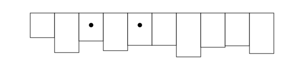
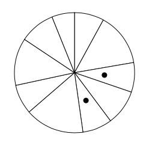
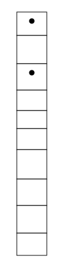

# Assignment 3 - Replicating a Classic Experiment  

## The Experiment
Link: https://kjmj.github.io/03-Experiment/#/

We designed a simple experiment to determine if bar, stacked bar, or pie charts are better for a user to differentiate length. The user was shown a graph with two marked bars/slices. Then, they had to determine which percent the smaller bar/slice is of the larger bar/slice. For example, if the smaller chart is half the size of the larger chart, the user would ideally enter '50'.

Some technical things - there was always one bar/slice in-between the two marked bars/slices, and we chose to exclude any sort of axis's from the charts. The bar chart was rendered upside down, and the stacked bar chart had only one bar. We chose to remove elements such as the axis in order to give the user a higher chance to focus on the graphs. Having labels and such could either distract the user or cause them to reply on such feature when determining their answer. We wanted to collect the purest data we could. We chose to have the bar graph upside-down to see if, when compared to Cleveland and McGill’s results, there would be a large difference.

## Results

### Confidence Interval

Here is the confidence interval for the three charts. As you can see, the bar chart performed best, followed by pie and then stacked bar. We will talk in more detail about our findings below. Overall, however, our results did line up generally with Cleveland and McGill’s results.

### Bar

- Min: 1.12
- Max: 2.06
- Average Error: 1.571

We thought that bar charts would perform the best, and in our experiment, it did. The bar chart had the lowest error, which is likely due to the fact that it is easiest for people to line up the bar heights. We think that bar charts are generally a solid way to represent data, as it is easy for people to compare the heights of bars.

### Pie

- Min: 1.76
- Max: 2.89
- Average Error: 2.339

In second place is the pie chart. It had a higher average error than the bar chart at 2.339. Pie charts can be deceiving, and while they may be good for representing a few categories, they don't always give the most accurate representation of your data. Pie charts are visually appealing, but might not be your first choice if your goal is to represent your data in the most accurate way possible.

### Stacked Bar

- Min: 2.23
- Max: 3.33
- Average Error: 2.811

The worst graph type that we tested was the stacked bar chart, with an average error of 2.811. For many people, it was hard to compare the stacked bars since you can't really line the top of the bars up easily. We generally wouldn’t recommend the use of the stacked bar chart. While our experiment only looked at a stacked bar chart with one bar, we predict that the accuracy would only go down as more bars were added to the chart.

## Some additional Graphs

We created a couple of graphs in Tableau to help explain our data. Here they are. THe Tableau workbook can also be accessed in the Tableau folder.

### Accuracy by Viz Type

This viz shows the Average Percent Difference by viz type. Average percent difference is the average of ABS(ReportedPercent - TruePercent) for each viz type. AS you can see, the graph alligns with our Confidence Interval Graph, showing Bar graphs eith the more precise answers and Stacked Bar graphs with the least accurate answers.

### Average True Reported Percent’s by Viz Type

This viz shows the difference for each viz type between the average true percent and the average reported percent. This allows to see, on averge, is users were answers higher of lower for each graph type. Bar graphs were almost perfect, pie charts were reported slightly below the true percent, and stacked bar graphs were reported a larger amount below the true percent. This shows that, out of the three, users had the hardest time with the stacked bar graphs and tended provide lower answers.

## Technical Achievements
1. We used react.js to create our website. This was a learning experience for both of us, but it served as a good intro to these component-based frameworks.
2. We ensure that user input is a valid number between 1 and 100, and don't let them continue to the next graph unless their input is good.
3. We created some additional graphs in Tableau to help explain and renforce our data. (see above)

## Design Achievements
1. We implemented a navbar, which was tougher than expected. GitHub pages didn’t play well with our original implementation, so we ended up using a [HashRouter](https://reacttraining.com/react-router/web/api/HashRouter)
2. While the website was very simple, we used bootstrap to style the different elements and components throughout the website.

## Project Setup

From the root directory:

`yarn install`

Install all dependencies for this project

`yarn start`

Runs the app in the development mode. 
Open [http://localhost:3000](http://localhost:3000) to view it in the browser.

The page will reload if you make edits. 
You will also see any lint errors in the console.

## Other Scripts

You can also run these scripts from the root directory:

`yarn test`

Launches the test runner in the interactive watch mode. 
See the section about [running tests](https://facebook.github.io/create-react-app/docs/running-tests) for more information.

`yarn build`

Builds the app for production to the `build` folder. 
It correctly bundles React in production mode and optimizes the build for the best performance.

The build is minified and the filenames include the hashes. 
Your app is ready to be deployed!

See the section about [deployment](https://facebook.github.io/create-react-app/docs/deployment) for more information.

`yarn eject`

**Note: this is a one-way operation. Once you `eject`, you can’t go back!**

If you aren’t satisfied with the build tool and configuration choices, you can `eject` at any time. This command will remove the single build dependency from your project.

Instead, it will copy all the configuration files and the transitive dependencies (Webpack, Babel, ESLint, etc) right into your project so you have full control over them. All of the commands except `eject` will still work, but they will point to the copied scripts so you can tweak them. At this point you’re on your own.

You don’t have to ever use `eject`. The curated feature set is suitable for small and middle deployments, and you shouldn’t feel obligated to use this feature. However we understand that this tool wouldn’t be useful if you couldn’t customize it when you are ready for it.

`predeploy`

Build the app for deployment. Run before `deploy`

`deploy`

Deploys the latest build to github pages. Note that the gh-pages branch is deployed, and not master

